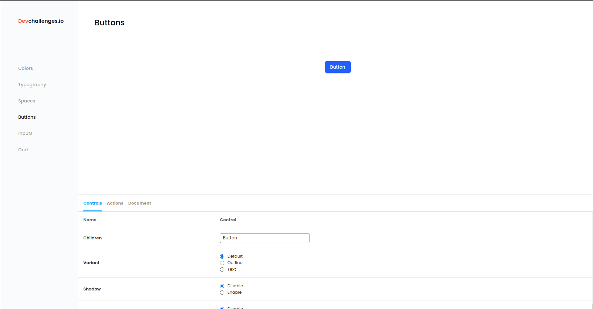

<!-- Please update value in the {}  -->

<h1 align="center">Button | Input Component Challenge</h1>

   Solution for a challenge from  <a href="http://devchallenges.io" target="_blank">Devchallenges.io</a>.

  <h3>
    <a href="https://reusable-component-master.web.app/">
      Demo
    </a>
     | 
    <a href="https://github.com/tatranan/ButtonComponent-DevChallenges">
      Solution
    </a>
     | 
    <a href="https://devchallenges.io/challenges/ohgVTyJCbm5OZyTB2gNY">
      Button Challenge
    </a>
     | 
    <a href="https://devchallenges.io/challenges/TSqutYM4c5WtluM7QzGp">
      Input Challenge
    </a>
    
  </h3>

<!-- TABLE OF CONTENTS -->

## Table of Contents

- [Overview](#overview)
- [Scripts](#scripts)
- [Features](#features)
- [Contact](#contact)

<!-- OVERVIEW -->

## Overview

Introduce your projects by taking a screenshot or a gif. Try to tell visitors a story about your project by answering:

- Work Hard, Play Hard

## Scripts

In the project directory, you can run:

### `npm start`

Runs the app in the development mode.\
Open [http://localhost:3000](http://localhost:3000) to view it in your browser.

The page will reload when you make changes.\
You may also see any lint errors in the console.

## Features

This application/site was created as a submission to a [DevChallenges](https://devchallenges.io/challenges) challenge. The [challenge](https://devchallenges.io/challenges/xobQBuf8zWWmiYMIAZe0) was to build an application to complete the given user stories.

## Contact

- GitHub [tatranan](https://github.com/tatranan)
- Youtube [Drio Brotoxo](https://www.youtube.com/channel/UC7CJBfb1bAIg6kCGmXwcoUQ/videos%25257D)
